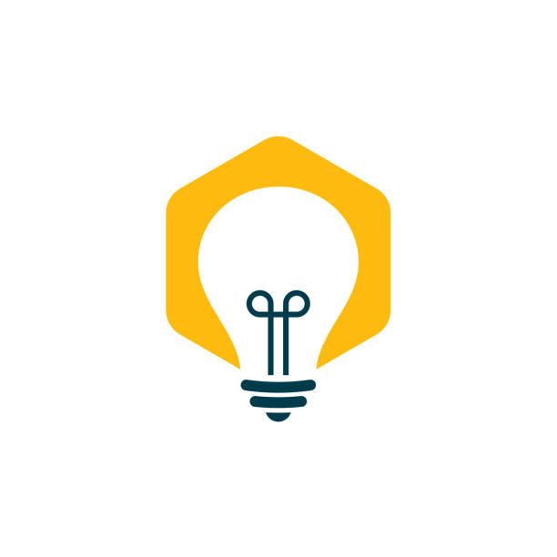
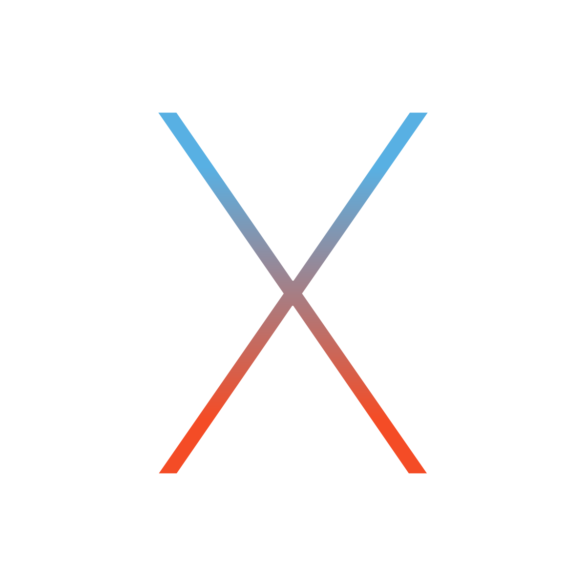

## WIP (Work In Progress) 👨🏻‍🔧
### Just a Software enginnering student 💻 fascinated by mathematics fields🧮
> Feel free to connect to me on [Linkedln](https://www.linkedin.com/in/eliazonta/)

<h1 align="center">
  
</h1>

<h5 align="center">
  <code>
    <a href="https://www.linkedin.com/in/eliazonta/" title="LinkedIn Profile"> LinkedIn</a></code>
  <code><a href="https://www.instagram.com/eliaazonta/" title="Instagram Profile">Instagram</a></code>
</h5>

 

  👋🏻 Hi, I'm Elia Zonta, a Software Engineering Student from Italy 🇮🇹 🍝 🤌🏻
   
   
  🔬 I'm currently studying for a bachelor's degree in Trento University Information Engineering Department
   
   
  🎓 I graduated from I.T.I.S. Enrico Fermi High School in the elettronics - automation field
   
   
  💻 I love solving problems, interact with people, and explore mathematics fields 🧮
   
   
  📚 I’m currently developing new skills and knowledge in statistic and Data Science 
   
   
  💬 Feel free to connect to me via <button src="https://www.linkedin.com/in/eliazonta/">Linkedln</button>
   

<h2 align="center">🎯👨🏻‍💻 Languages, Frameworks, Tools & Abilities 👨🏻‍💻🎯</h2>
 

  <code></code>
  <code></code>
  <code></code>
  <code></code>
  <code></code>
  <code></code>
  <code></code>
  <code></code>
  <code></code>
  <code></code>
  <code></code>
  <code></code>
  <code></code>
  <code></code>
  <code></code>

<!--
//=======================================

<h2 align="center">⚡ Stats ⚡</h2>
 

  

    
    
  

           
  

    
  

   
  

<h2 align="center">👨‍💻 Repositories 👨‍💻</h2>
 

  

      

  
  

      

  
  

      

  
  

      
<h4 align="center">
  <a href="https://github.com/zumrudu-anka?tab=repositories" title="Show Repositories">🔎 Show More 🔍</a>
</h4>

<!--
**zumrudu-anka/zumrudu-anka** is a ✨ _special_ ✨ repository because its `README.md` (this file) appears on your GitHub profile.

Here are some ideas to get you started:

- 🔭 I’m currently working on ...
- 🌱 I’m currently learning ...
- 👯 I’m looking to collaborate on ...
- 🤔 I’m looking for help with ...
- 💬 Ask me about ...
- 📫 How to reach me: ...
- 😄 Pronouns: ...
- ⚡ Fun fact: ...

Notes: If you want use this readme, firstly star it please. If you can't align your repositories like this, please change your repository desription to shorter than now. Maybe 4 or 5 word will be good.

-->
